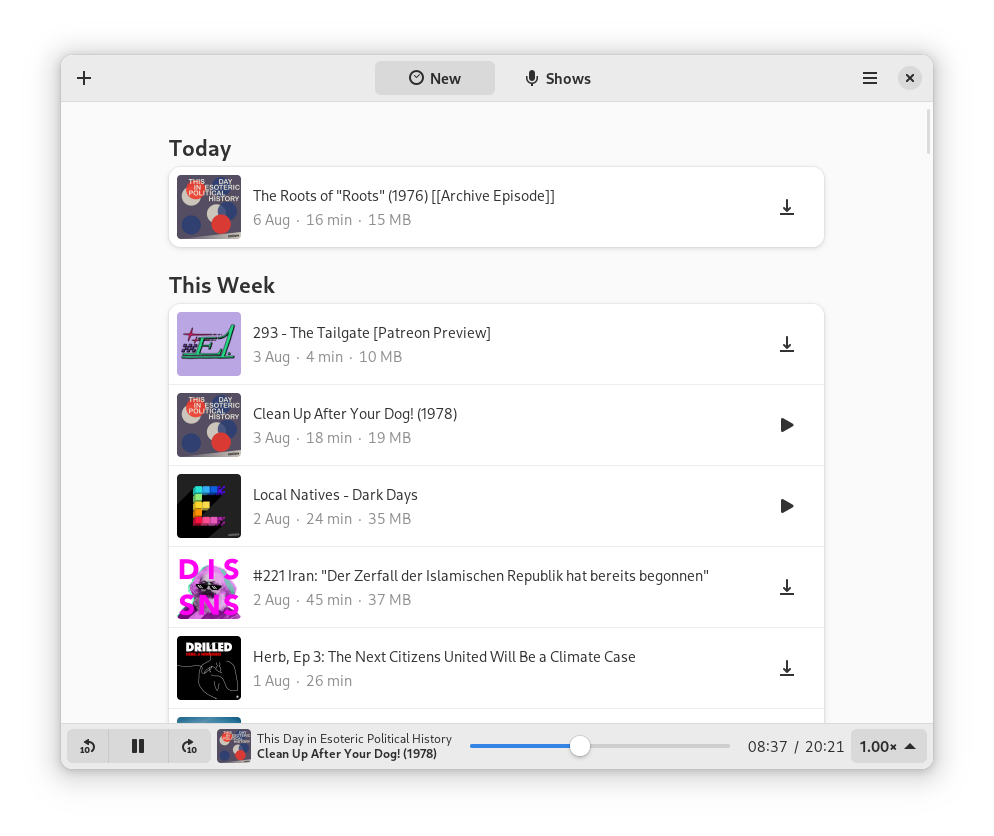
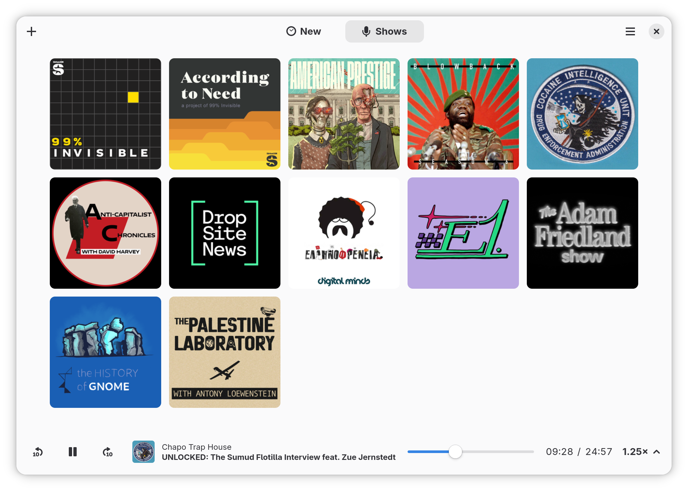
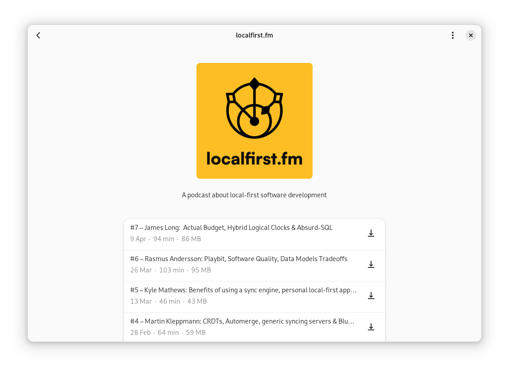

# GNOME Podcasts

### A Podcast application for GNOME.
Listen to your favorite podcasts, right from your desktop.





## Available on Flathub

[](https://flathub.org/apps/details/org.gnome.Podcasts)

## Quick start

GNOME Podcasts can be built and run with [Gnome Builder][builder] >= 3.28.
Just clone the repo and hit the run button!

You can get Builder from [here][get_builder].

## Broken Feeds

Found a feed that does not work in GNOME Podcasts?
Please [open an issue][new_issue] and choose the `BrokenFeed` template so we will know and fix it!

## Getting in Touch

If you have any questions regarding the use or development of GNOME Podcasts,
want to discuss design or simply hang out, please join us on our [irc][irc] or [matrix][matrix] channel.

## Building

### Flatpak

Flatpak is the recommended way of building and installing GNOME Podcasts.
Here are the dependencies you will need.

```sh
# Add flathub and the gnome-nightly repo
flatpak remote-add --user --if-not-exists flathub https://dl.flathub.org/repo/flathub.flatpakrepo
flatpak remote-add --user --if-not-exists gnome-nightly https://nightly.gnome.org/gnome-nightly.flatpakrepo

# Install the gnome-nightly Sdk and Platform runtime
flatpak install --user gnome-nightly org.gnome.Sdk org.gnome.Platform

# Install the required rust-stable extension from flathub
flatpak install --user flathub org.freedesktop.Sdk.Extension.rust-stable//19.08
```

To install the resulting flatpak you can do:

```bash
flatpak-builder --user --install --force-clean --repo=repo podcasts org.gnome.Podcasts.json
```

### Building from source

```sh
git clone https://gitlab.gnome.org/World/podcasts.git
cd gnome-podcasts/
meson --prefix=/usr build
ninja -C build
sudo ninja -C build install
```

#### Dependencies

* Rust stable 1.27 or later along with cargo.
* Gtk+ 3.22 or later
* Gstreamer 1.12 or later
* libhandy
* Meson
* A network connection

Offline build are possible too, but [`cargo-vendor`][vendor] would have to be setup first

## Contributing

There are a lot of things yet to be done.

If you want to contribute, please check the [Contributions Guidelines][contribution-guidelines].

You can start by taking a look at [Issues][issues] or by opening a [New issue][new_issue].

There are also some minor tasks tagged with `TODO:` and `FIXME:` in the source code.

[contribution-guidelines]: https://gitlab.gnome.org/World/podcasts/blob/master/CONTRIBUTING.md

### Translations

Translation of this project takes place on the GNOME translation platform,
[Damned Lies](https://l10n.gnome.org/module/podcasts). For further
information on how to join a language team, or even to create one, please see
[GNOME Translation Project wiki page](https://wiki.gnome.org/TranslationProject).


## Overview

```sh
$ tree -d
├── screenshots         # png's used in the README.md
├── podcasts-data        # Storate related stuff, SQLite, XDG setup, RSS Parser.
│   ├── migrations      # Diesel SQL migrations.
│   │   └── ...
│   ├── src
│   └── tests
│       └── feeds       # Raw RSS Feeds used for tests.
├── podcasts-downloader  # Really basic, Really crappy downloader.
│   └── src
├── podcasts-gtk         # The Gtk+ Client
│   ├── resources       # GResources folder
│   │   └── gtk         # Contains the glade.ui files.
│   └── src
│       ├── stacks      # Contains the gtk Stacks that hold all the different views.
│       └── widgets     # Contains custom widgets such as Show and Episode.
```

## A note about the project's name

The project used to be called Hammond, after Allan Moore's character [Evey Hammond][hammond] from the graphic novel V for Vendetta.
It was renamed to GNOME Podcasts on 2018/07/24 shortly before its first public release.

## Acknowledgments

GNOME Podcasts's design is heavily inspired by [GNOME Music][music] and [Vocal][vocal].

We also copied some elements from [GNOME News][news].

And almost the entirety of the build system is copied from the [Fractal][fractal] project.

[vendor]: https://github.com/alexcrichton/cargo-vendor
[irc]: irc://irc.gnome.org/#hammond
[matrix]: https://matrix.to/#/#gnome-podcasts:matrix.org
[flatpak_setup]: https://flatpak.org/setup/
[music]: https://wiki.gnome.org/Design/Apps/Music
[vocal]: http://vocalproject.net/
[news]: https://wiki.gnome.org/Design/Apps/Potential/News
[fractal]: https://gitlab.gnome.org/World/fractal
[hammond]: https://en.wikipedia.org/wiki/Evey_Hammond
[issues]: https://gitlab.gnome.org/World/podcasts/issues
[new_issue]: https://gitlab.gnome.org/World/podcasts/issues/new
[builder]: https://wiki.gnome.org/Apps/Builder
[get_builder]: https://wiki.gnome.org/Apps/Builder/Downloads
