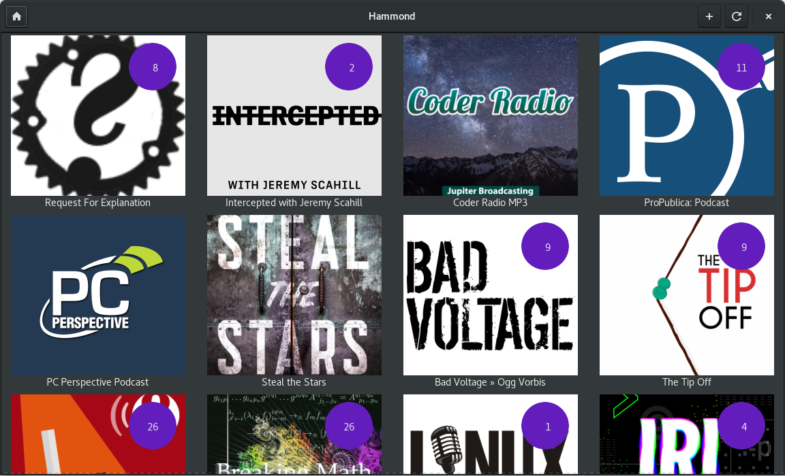
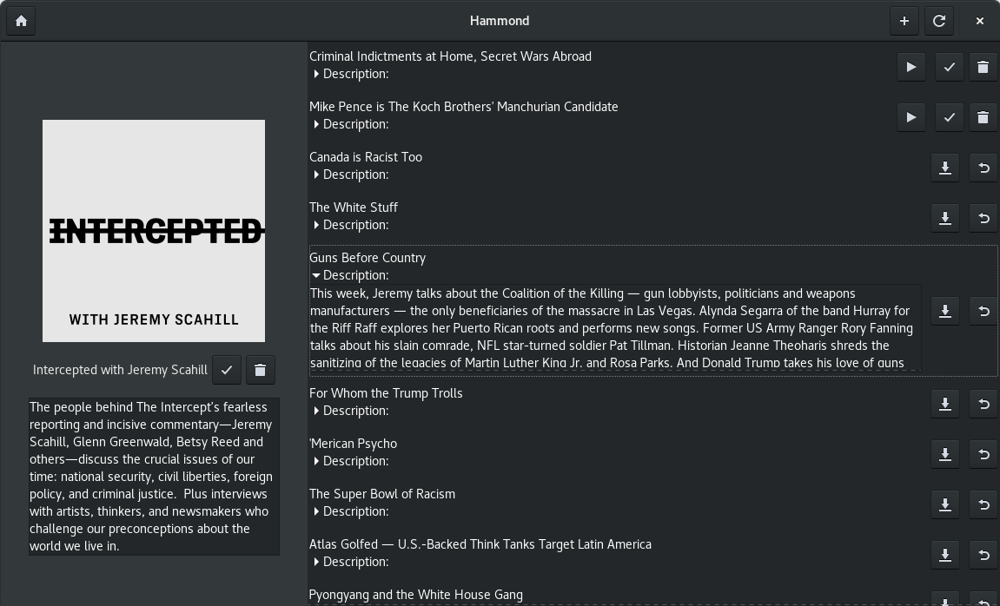

# Hammond
## Multithreaded, safe, and reliable Gtk+ Podcast client.
This is a prototype of a podcast client written in Rust.

[](https://gitlab.gnome.org/alatiera/Hammond/commits/master)




## Quick start
```sh
git clone https://gitlab.gnome.org/alatiera/hammond.git
cd Hammond/
cargo run -p hammond-gtk --release
```
### Flatpak:
Flatpak instructions... Soon™.

## Dependancies:

* Rust stable 1.21 or later.
* Gtk+ 3.22 or later

**Debian/Ubuntu**:
```sh
apt-get update -yqq
apt-get install -yqq --no-install-recommends build-essential
apt-get install -yqq --no-install-recommends libgtk-3-dev
```

**Fedora**:
```sh
dnf install -y gtk3-devel glib2-devel openssl-devel sqlite-devel
```

If you happen to build it on other distributions please let me know the names of the corresponding libraries. Feel free to open a PR or an Issue to note it.

## Building:

```sh
git clone https://gitlab.gnome.org/alatiera/Hammond.git
cd Hammond/
cargo build --all
```

## Overview:

```sh
$ tree -d
├── assets              # png's used in the README.md
├── hammond-data        # Storate related stuff, Sqlite db, XDG setup.
│   ├── migrations      # Diesel migrations.
│   │   └── ... 
│   ├── src
│   └── tests
│       └── feeds       # Raw RSS Feeds used for tests.
├── hammond-downloader  # Really basic, Really crappy downloader.
│   └── src
├── hammond-gtk         # The Gtk+ client.
│   ├── gtk             # Contains the glade.ui files and.
│   └── src
│       ├── views       # Currently only contains the Podcasts_view.
│       └── widgets     # Contains custom widgets such as Podcast and Episode.
```

## Contributing:
There alot of thins to be done, take a look at TODO.md or grep for TODO: and FIXME:.

to be added: CONTRIBUTING.md

## A note about the project's name:

The project was named after Allan Moore's character [Evey Hammond](https://en.wikipedia.org/wiki/Evey_Hammond) from the graphic novel V for Vendetta.

It has nothing to do with the horrible headlines on the news.
